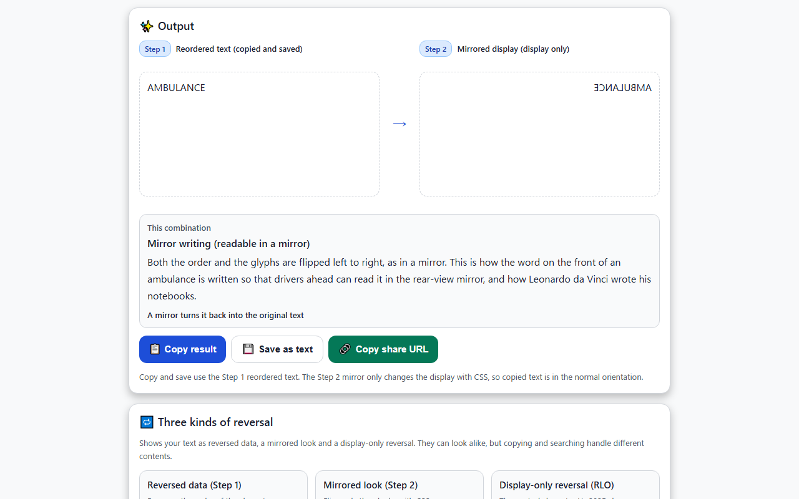
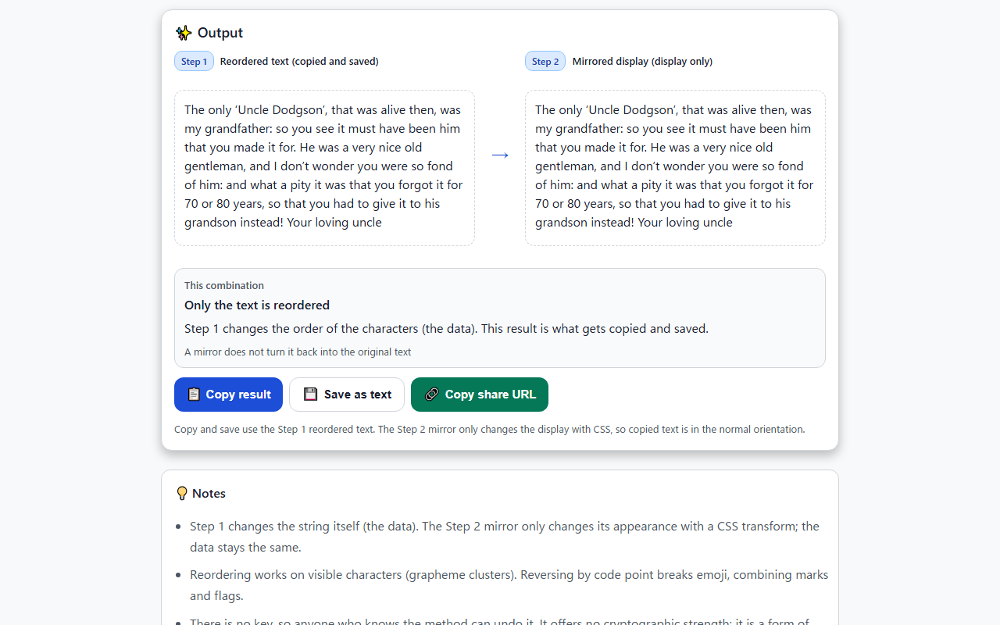
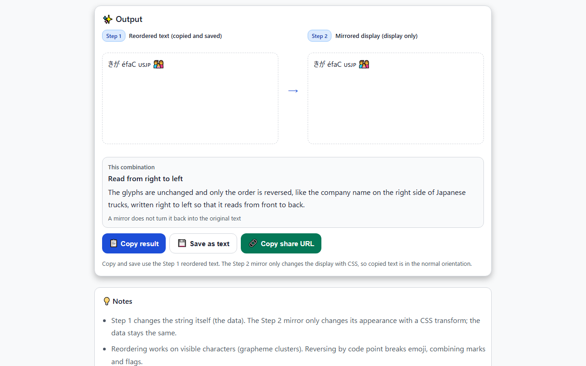
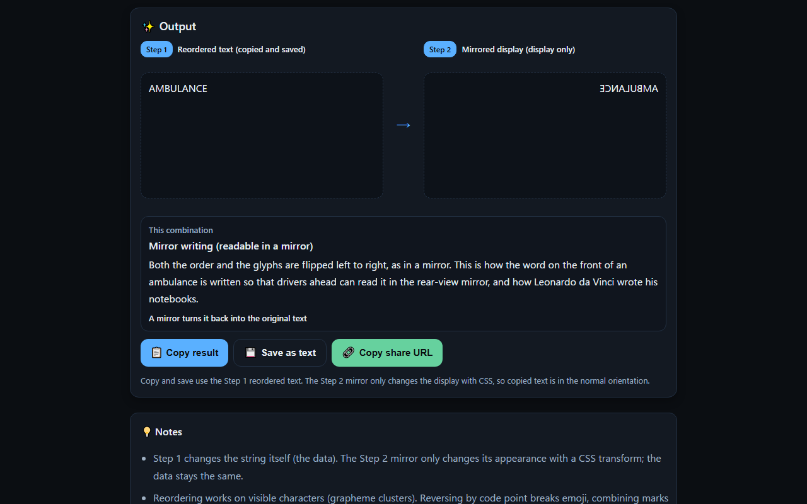
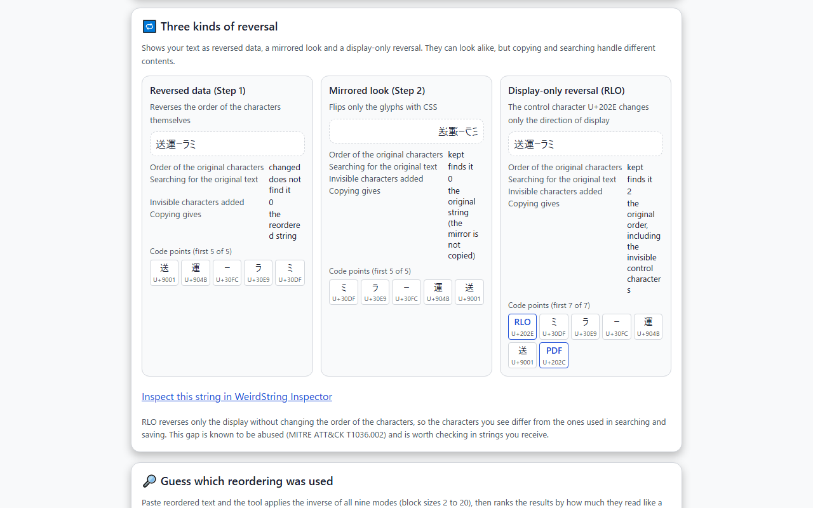
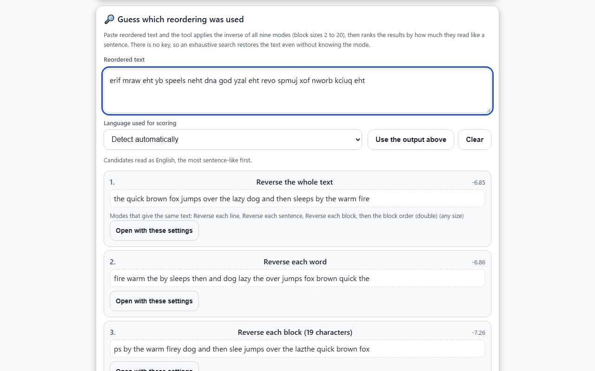
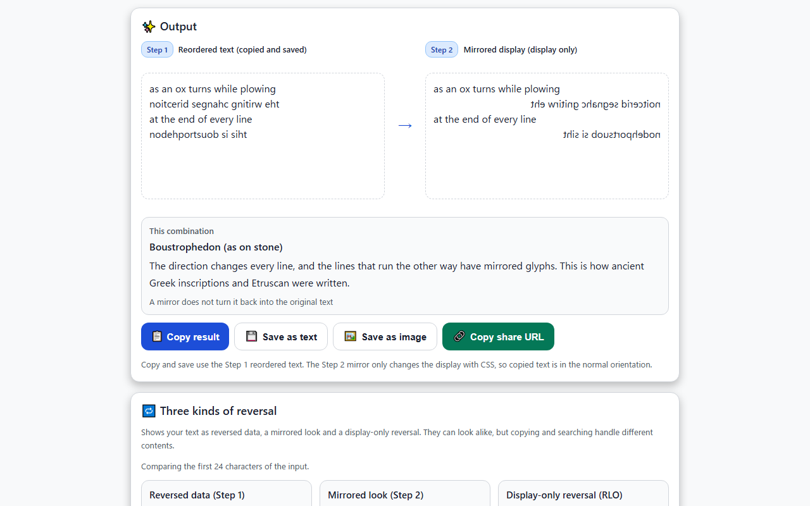

English · [日本語](README.md)

# Mirror CipherLab - Mirror Cipher and Obfuscation Lab


[](https://ipusiron.github.io/mirror-cipherlab/)

**Day084 - 100 Security Tools with Generative AI**

Mirror CipherLab is an educational tool for experiencing reverse transposition (reversing the order of characters) combined with mirrored glyphs.

It offers nine ways of reordering text, including the whole text, each word, the word order, lines, sentences and blocks, and it works on visible characters (grapheme clusters) so that emoji and combining marks never break. For each combination it shows whether a mirror turns the result back into the original text and which real-world lettering it resembles.

It also compares reversed data, a mirrored look and a display-only reversal (the RLO control character), and it can guess which mode was used on a piece of reordered text by exhaustive search.

---

## 🌐 Demo

👉 **[https://ipusiron.github.io/mirror-cipherlab/](https://ipusiron.github.io/mirror-cipherlab/)**

Try it directly in your browser.

---

## 📸 Screenshots

>
>
>*Mirror writing as on the front of an ambulance (no reordering + horizontal mirror)*

>
>
>*Reading Carroll's backwards letter with word-order reversal*

>
>
>*Emoji, flags and combining marks stay whole when reversed*

>
>
>*Dark mode (ambulance example)*

>
>
>*Three kinds of reversal, down to the code points*

>
>
>*Guessing which reordering was used, most sentence-like first*

>
>
>*Boustrophedon (direction changes per line; only those lines have mirrored glyphs)*

The default Windows fonts have no flag emoji, so flags are shown as two regional indicator letters (such as JP and US).

---

## ✨ Features

### Step 1: Reorder (changes the text)

This step reorders the string itself. Copying, saving and sharing use this result (`\n` in the table is a line break).

| Mode | What it does | Input | Output |
|---|---|---|---|
| No reordering | Nothing (for trying only the Step 2 mirror) | `Hello world!` | `Hello world!` |
| Reverse the whole text | Arranges everything from the end | `Hello world!` | `!dlrow olleH` |
| Reverse each word | Reverses the spelling of each word and keeps punctuation and spaces in place | `Hello, world!` | `olleH, dlrow!` |
| Reverse the word order | Reverses the order of words and punctuation, attaches punctuation to the preceding word and flips brackets | `Hello (big) world.` | `. world (big) Hello` |
| Reverse each line | Reverses each line and keeps the line order | `abc\ndef` | `cba\nfed` |
| Reverse the line order | Reverses only the order of lines | `1\n2\n3` | `3\n2\n1` |
| Reverse each sentence | Keeps sentence-ending marks and spaces in place and reverses the text of each sentence | `Line one. Line two!` | `eno eniL. owt eniL!` |
| Reverse each block (n=5) | Splits the text into blocks of n characters and reverses each block | `ATTACKATDAWN` | `CATTAADTAKNW` |
| Reverse each block, then the block order (n=5) | Reverses each block, then the order of the blocks | `ATTACKATDAWN` | `NWADTAKCATTA` |
| Boustrophedon | Reverses the even lines (the 2nd, 4th and so on) | `abc\ndef` | `abc\nfed` |

- The block size is 2 to 20 (default 5).
- "Fix capitals at sentence starts" capitalizes the new sentence starts after reordering (see "How it works").

### Step 2: Mirror the glyphs (display only)

| Option | CSS | Appearance |
|---|---|---|
| No mirror | none | As it is |
| Horizontal mirror | `transform: scaleX(-1)` | As seen in an upright mirror |
| Vertical mirror | `transform: scaleY(-1)` | As reflected in water |
| Rotate 180 degrees | `transform: scale(-1, -1)` | As seen with the paper turned upside down |

With boustrophedon the mirror is applied line by line: only the lines that run the other way are flipped, matching the stone inscriptions.

The string does not change, so copied text is in the normal orientation.

### What each combination means

For each combination of Step 1 and Step 2, the page explains how it looks, gives a real-world example and tells you whether a mirror turns it back into the original text.

| Step 1 | Step 2 | Appearance | In a mirror | Real-world example |
|---|---|---|---|---|
| No reordering | Horizontal mirror | Mirror writing | Turns back into the original | Lettering on the front of ambulances, Leonardo da Vinci's notebooks |
| No reordering | Vertical mirror | Reflection in water | Turns back with a mirror placed below | — |
| Reverse the whole text | No mirror | Read from right to left | Does not turn back | Company names on the right side of Japanese trucks |
| Reverse the whole text | Horizontal mirror | Original order, flipped glyphs | Does not turn back | Like a row of hidari-uma ("left horse") charms |
| Reverse the whole text | Vertical mirror | Reversed and flipped upside down | Does not turn back | — |
| Reverse the whole text | Rotate 180 degrees | The reversal and the rotation cancel out | Does not turn back | — |
| Boustrophedon | Horizontal mirror | Direction changes every line; the reversed lines have mirrored glyphs | Does not turn back | Ancient Greek inscriptions, Etruscan |
| Any other mode | With or without a mirror | Only the text is reordered (and mirrored) | Does not turn back | — |

### Three kinds of reversal

The tool shows your text in three ways. They can look alike, but copying and searching handle different contents.

| Kind | Order of the characters | Searching for the original | What copying gives |
|---|---|---|---|
| Reversed data (Step 1) | changed | does not find it | the reordered string |
| Mirrored look (Step 2) | unchanged | finds it | the original string (the mirror is not copied) |
| Display-only reversal (RLO) | unchanged (control characters added) | finds it | the original order, including the control characters |

Each code point is listed one by one, with invisible characters shown by name (RLO, PDF and so on).
The RLO control character (U+202E) reverses only the display, so the characters you see differ from the ones used in searching and saving.
This gap is known to be abused (MITRE ATT&CK T1036.002) and is worth checking in strings you receive.
A link passes the string to WeirdString Inspector (Day023).

### Guessing which reordering was used

Paste reordered text and the tool applies the inverse of all nine modes (block sizes 2 to 20) and lists up to five results, the most sentence-like first.
There is no key, so an exhaustive search restores the text even without knowing the mode.
How sentence-like a result is comes from how common its character sequences are (four-character sequences plus a common-word check for English, three-character sequences for Japanese).
The statistics live in `js/lang-model.js`, built from public domain texts (see "Accuracy of the guessing").

### Other features

- Seven examples (Swift, Carroll, ambulance, truck, emoji, boustrophedon, doubling). Choosing one sets the text and the settings.
- Shows three counts: visible characters, code points and UTF-16 length.
- Copies the result, and saves it as a text file or a PNG image.
- Share URL (the text and settings go after `#` in the URL; the length is shown, with a warning above 2,000 characters).
- Dark and light modes (follows the OS setting; a button switches them).
- Japanese and English UI (also selectable with `?lang=ja` or `?lang=en`; the choice is saved in the browser).
- Font selection (System UI, Serif, Monospace).

---

## 📖 How to use

1. Type text into the input (or choose one from "Load an example").
2. In "Settings", choose a reordering mode in Step 1 and a mirror in Step 2.
3. In "Output", see the reordered text (Step 1), the mirrored display (Step 2) and the explanation of the combination.
4. Use "Copy result" or "Save as text" to take the result. "Copy share URL" passes the same text and settings to someone else.

To undo, put the reordered text into the input and choose the same mode and settings. Every mode restores the original when applied twice (except "Reverse each word" on Japanese; see "How it works").

---

## 🔐 The mirror cipher is a transposition cipher

The mirror cipher arranges the plaintext in reverse order.
It only moves characters without changing them, so it is one of the simplest transposition ciphers.
This kind of transposition is called reverse transposition, so the mirror cipher is also called the **reverse transposition cipher**.

---

### Mirror writing and the mirror-writing cipher

Mirror writing is writing that is flipped left to right, as seen in a mirror.

In English, not only the letters but often the direction of writing is reversed (right to left).
If the slant of the letters is kept as usual, the text looks like a row of strange letters when held up to a mirror.

A mirror-writing cipher is a string that turns back into the original message when held up to a mirror (or read backwards).
Like the reverse transposition cipher, its characters are in reverse order, but the big difference is that each character itself is flipped.
In this tool, "No reordering" in Step 1 combined with "Horizontal mirror" in Step 2 gives the look of a mirror-writing cipher.

---

### Variations

- Words in reverse order ("Reverse the word order" in this tool)
  - Reading from the end makes sense.
  - It can be seen as a word-level variant of a palindrome.
  - Example 1 below
- The spelling of each word reversed ("Reverse each word")
  - Example 2 below
- Reversal by sentence ("Reverse each sentence")
- Splitting into blocks of a fixed number of characters and reversing within each block ("Reverse each block")
  - For example, with five-character blocks, the 1st and 5th characters and the 2nd and 4th characters are swapped.
- Doubled transposition ("Reverse each block, then the block order")
  - Apply some transposition within each block (reversal is fine), then reverse the order of the blocks.
  - If both steps are reversals, the result is exactly the same as reversing the whole text (see "How it works").

Example 1: part of a letter from Lewis Carroll to Nellie Bowman (1 November 1891), as transcribed by Futility Closet.

> Uncle loving your! Instead grandson his to it give to had you that so, years 80 or 70 for it forgot
> you that was it pity a what and: him of fond so were you wonder don’t I and, gentleman old nice very a
> was he. For it made you that him been have must it see you so: grandfather my was, then alive was that,
> ‘Dodgson Uncle’ only the

The words are in reverse order.
Choosing "Reverse the word order" and "Fix capitals at sentence starts" in this tool gives the following text.

> The only ‘Uncle Dodgson’, that was alive then, was my grandfather: so you see it must have been him
> that you made it for. He was a very nice old gentleman, and I don’t wonder you were so fond of him:
> and what a pity it was that you forgot it for 70 or 80 years, so that you had to give it to his
> grandson instead! Your loving uncle

Just as "grandfather: so" in the forward text appears as "so: grandfather" in the letter, Carroll also reversed colons and commas as units and attached them to the preceding word.

Example 2: mock Latin attributed to Jonathan Swift.

> Mi sana. Odioso ni mus rem. Moto ima os illud dama nam?

↓ Reverse the spelling of each word and fix the capitals ("Reverse each word" and "Fix capitals at sentence starts" in this tool).

> Im anas. Osoido in sum mer. Otom ami so dulli amad man?

↓ Adjust spaces, punctuation and missing letters so that it makes sense.

> I'm an ass. O so I do in summer. O Tom, am I so dull, I a mad man?

This text is sometimes introduced as a letter to Richard Brinsley Sheridan, but R. B. Sheridan was born after Swift's death (in 1751).
Swift's friend was his grandfather Thomas Sheridan (1687-1738), which also fits the "O Tom" in the text.
However, the original letter containing this text has not been confirmed.

---

## 🔬 How it works

### Reordering by visible character (grapheme cluster)

A character that looks like one character on screen may consist of several code points.
Reversing by code point swaps the parts and produces a different character.

| Input | Reversed by code point | This tool |
|---|---|---|
| Family emoji (U+1F468, ZWJ, U+1F469, ZWJ, U+1F467) | A different sequence (child, mother, father); some fonts show three separate emoji | Moves as one character |
| "gaki" written with "ka" + combining dakuten (U+3099) + "ki" | The dakuten attaches to "ki" and gives "gika" | "kiga" |
| Flags of Japan and the United States (regional indicators J, P, U, S) | Becomes the pairs S-U and P-J, a different or unreadable pair | United States, then Japan |
| "Café!" written with "e" + combining acute (U+0301) | The accent attaches to "!" | "!éfaC" |

JavaScript's `[...str].reverse()` and CyberChef's Reverse (Character) only protect surrogate pairs, so all of the examples above break.
This tool splits the text with `Intl.Segmenter` (`granularity: "grapheme"`) before reordering.
The page shows the number of visible characters, code points and the UTF-16 length; one family emoji is shown as 1 visible character, 5 code points and a UTF-16 length of 8.

### Word segmentation

"Reverse each word" and "Reverse the word order" split words with `Intl.Segmenter` (`granularity: "word"`).
Japanese is written without spaces, so the browser splits it into words with a dictionary (for example, `世界で一番。` becomes `世界` / `で` / `一番` / `。`).

"Reverse the word order" reorders commas, colons, exclamation marks and quotation marks as units and attaches them to the preceding word.
Brackets and quotation marks (‘ ’ “ ” and the Japanese corner brackets) are flipped.
Where punctuation rules do not decide the spacing, the tool copies whether the same two units were separated by a space in the original text (no spaces are inserted between Japanese words).

### Sentences, blocks and doubling

- Sentences: sentence-ending marks (. ! ? … and their Japanese forms) and the spaces and line breaks around them stay in place, and the text between them is reversed.
- Blocks: line breaks count as characters. The last block may be shorter, and it is reversed too.
- Doubling: reversing the whole text is the same as reversing the order of the blocks and reversing within each block, so the result always equals reversing the whole text, whatever the block size (the tests check sizes 2 to 20).

### Boustrophedon

Only the even lines (the 2nd, 4th and so on) are reversed.
It is the way of writing that turns at the end of each line, as an ox turns while plowing (the name comes from the Ancient Greek for "ox" and "turn").
It appears on ancient Greek stone inscriptions and in Etruscan, and **the lines running the other way were carved with mirrored letters**.
In this tool Step 1 handles the order and Step 2 handles the glyphs.
Choosing "Horizontal mirror" in Step 2 flips only the lines that run the other way, which matches the inscriptions.

### Applying twice restores the text

Every mode restores the original text when applied again with the same settings.
However, "Reverse each word" on Japanese may not, because the dictionary may split the reversed kanji into different words.
For example, `世界で一番。` becomes `界世で番一。`, and applying it again leaves `界世で番一。` unchanged (the reversed pairs are split into single characters).

### Fixing capitals at sentence starts

Words that were capitalized only because they started a sentence are lowercased before reordering, and the first word of each sentence is capitalized afterwards.
One-letter words such as "I" and words with capitals after the first letter such as "NASA" are left as they are.
Sentence boundaries are detected by sentence-ending marks (. ! ? …).
Proper nouns are not detected, so a proper noun at the start of a sentence becomes lowercase (this is why "Uncle" at the end of Example 1 becomes "uncle").

### Saving as an image

The Step 2 mirror is a CSS transform, so a plain capture of the page would not contain it.
"Save as image" redraws the characters onto a canvas and applies the same transform.
With boustrophedon the transform changes per line, flipping only the lines that run the other way.
Long text is cut at 60 lines and 200 characters per line, and the page says so.
The background and text colors follow the current theme.

### Accuracy of the guessing

The guessing was measured on text that was not used to build the statistics.
The first 70% of each work went into the statistics and the remaining 30% into the measurement: pieces of that text were reordered with each mode and then passed to the solver.
A result counts as correct when the original text appears among the candidates (modes that give the same text cannot be told apart for that piece).

| Length | English, 1st | English, top 3 | Japanese, 1st | Japanese, top 3 |
|---|---|---|---|---|
| 20 characters | 54.3% | 73.8% | 40.7% | 56.9% |
| 40 characters | 62.4% | 89.0% | 47.6% | 68.3% |
| 80 characters | 84.0% | 96.4% | 59.5% | 75.7% |
| 160 characters | 86.4% | 94.8% | 70.0% | 72.9% |

Per mode at 160 characters (how often the first candidate was correct):

| Mode | English | Japanese |
|---|---|---|
| Reverse the whole text | 88.3% | 95.0% |
| Reverse each word | 98.3% | 0% (cannot be restored) |
| Reverse the word order | 63.3% | 10.0% |
| Reverse each line | 88.3% | 95.0% |
| Reverse each sentence | 78.3% | 95.0% |
| Reverse each block | 100% | 100% |
| Reverse each block, then the block order | 88.3% | 95.0% |

Two cases are hard.

- Japanese "reverse each word" does not come back when applied again, so it never appears among the candidates (see "Applying twice restores the text")
- "Reverse the word order" is hard to tell apart because both the restored text and the word-reversed text read as words, especially in Japanese

Short text is harder, and the page warns when the input is under 12 characters.

---

## 📜 Historical background

Mirror writing has attracted attention more as a cultural and psychological phenomenon than as a cipher.

- Ancient examples
  - Etruscan was often written from right to left. Stone inscriptions in ancient Greece and elsewhere used boustrophedon, which changes direction every line, and the letters in reversed lines were also mirrored (the "Boustrophedon" mode with a horizontal mirror reproduces this).
- Famous modern examples
  - Leonardo da Vinci's notebooks contain many records in mirror writing, and there are several theories, such as secrecy or the ease of writing for a left-handed person.
  - The neurologist Macdonald Critchley described the phenomenon of mirror writing in the book *Mirror-Writing* (1928).
  - Lewis Carroll wrote letters to be read in a mirror and letters with the words in reverse order (Example 1). In *Through the Looking-Glass* (1871), Alice finds a book in mirror writing, realizes that the words go the right way when held up to a glass, and reads the poem "Jabberwocky".
- Examples in Japan
  - Hidari-uma ("left horse"), the kanji for horse written mirrored, is a well-known good-luck design on shogi pieces from Tendo, Yamagata, given as a gift for a new house or a new business.
  - Some cities (such as Nagoya, Ichinomiya, Iwakura and Yokohama) write the word for ambulance mirrored on the front of their ambulances, so that drivers ahead can read it correctly in the rear-view mirror.
  - Company names on the right side of trucks are sometimes written from right to left so that they read from front to back. The glyphs are normal and only the order is reversed, so this is not mirror writing.

---

## 🔍 Cryptographic value

The mirror cipher only rearranges characters by a fixed rule and has no key.
Anyone who knows the method can undo it, so it offers no security in the sense of Kerckhoffs's principle (a system should be secure even if everything except the key is public).

- Ease of decryption
  - A person can read it simply by reading backwards.
  - A computer restores it with a one-liner (such as `[::-1]`). Note that `[::-1]` works on code points, so emoji and combining marks break (see "How it works").
  - This tool has nine modes, and even with the block sizes there are only a few combinations to try.
- Doubling adds no strength
  - Reversing within blocks and then reversing the block order is the same as reversing the whole text.
  - It is different from double transposition, which stacks keyed transpositions (try Permutation CipherLab).

In short, its value as a cipher is **limited to education and play**.

---

## 🎯 Use cases

### Ways of using this tool in particular

- Confirming the involution (applying it twice returns to the start) (information and cryptography classes): reversing the whole text is an involution, so applying the same operation twice returns to the start. Reversing `Hello, World!` twice returns `Hello, World!`. A palindrome is unchanged even once, and `たけやぶやけた` stays `たけやぶやけた` when reversed. You can confirm by computation that a keyless method can be undone by anyone.
- Confirming that "one character" differs between graphemes and code points (character-encoding classes): `a👨‍👩‍👧b` has a visible count (graphemes) of 3, a code-point count of 7 and a UTF-16 length of 10. Reversing by grapheme gives `b👨‍👩‍👧a`, keeping the family emoji (a ZWJ-joined sequence) intact. Reversing by code point breaks the sequence, so you can confirm that the result changes with the unit you count "one character" in.
- Confirming that boustrophedon reverses only the even lines (typesetting and history-of-writing classes): turning the three lines `abc` / `def` / `ghi` into boustrophedon leaves the first line as is and reverses only the second, giving `abc` / `fed` / `ghi`. The index of the reversed line is (zero-based) 1, that is, only the even-numbered lines. You can confirm by computation the ancient way of writing that alternates direction line by line.

### Learning and teaching

- Information and security classes: confirm that a keyless method can be undone by anyone, by applying the same operation twice. A good introduction to the difference between encryption and obfuscation.
- Learning programming: enter characters whose visible count, code points and UTF-16 length differ, and investigate why reversing a string breaks emoji. It is also a practical example of `Intl.Segmenter`.
- Language classes and word games: check that palindromes stay the same under "Reverse the whole text", or write reversed words like Swift's example.
- History and literature research: read historical texts such as Carroll's backwards letter step by step. The examples reproduce the same operations.

### Work

- Software testing: create test data whose visible length differs from the UTF-16 length, for checking input limits and cursor movement. The counts come from the browser's `Intl.Segmenter` and may differ from other operating systems or programming languages.
- Drafting signs and displays: check with the horizontal mirror how lettering meant to be read in a mirror, like on an ambulance, will look. It is for on-screen checks only; make the data for printing or vehicles separately.
- Preparing material for psychology experiments: prepare mirror-written or reversed sentences as reading stimuli. The display uses CSS transforms and depends on the font and environment, so present them in the same environment. There is a body of research on reading transformed text, such as the report that people read an inverted (upside-down) text faster a year after having read it once (Kolers 1976).

### Everyday life and hobbies

- Making puzzles and escape games: create puzzles with word-order reversal or block reversal, and check the answer by applying the same settings again.
- Letters and cards: save a message that can be read in a mirror as an image and print it.
- Follow an ancient hand: write a few lines in boustrophedon and save the image to see the direction turn line by line.

### Security

- Learn how display-only reversal differs: "Three kinds of reversal" puts reversed data, a mirrored look and a display-only reversal (RLO, U+202E) side by side. RLO changes only the display, so what you see differs from what searching and saving use (MITRE ATT&CK T1036.002). The string can be passed straight to WeirdString Inspector to check where the control characters are.
- Learn the limits of simple obfuscation: paste reordered text into "Guessing which reordering was used" and watch it come back without knowing the mode. It shows, hands on, that keyless obfuscation does not keep text away from searching or reading.

### Combining with other tools

- [Permutation CipherLab](https://ipusiron.github.io/permutation-cipherlab/) (Day095): compare with keyed transposition and see how the key changes the security.
- [Classical Cipher Structure Trainer](https://ipusiron.github.io/classical-cipher-structure-trainer/) (Day097): combine with practice on the structure of classical ciphers, including reversal.
- [Scytale Cipher Visualizer](https://ipusiron.github.io/scytale-cipher-visualizer/) (Day010): compare with another transposition cipher, the scytale.
- [WeirdString Inspector](https://ipusiron.github.io/weirdstring-inspector/) (Day023): inspect invisible characters such as RLO and compare with display-only reversal.

---

## 🔒 Security

- The text is processed only in the browser and is never sent anywhere.
- CSP (meta): `default-src 'none'; script-src 'self'; style-src 'self'; img-src 'self' data:; base-uri 'none'; form-action 'none'`. No inline scripts, style attributes or event handlers.
- Output is written with `textContent` only.
- The share URL puts the text and settings after `#` as base64url JSON. The part after `#` is not sent to the server, but the text remains for the recipient and in the browser history.
- When loading a share URL, the format, the length (up to 50,000 characters) and the settings are checked against allowlists, and anything that does not match is not loaded and the reason is shown.
- Only the theme and language choices are saved in the browser (localStorage). The tool works even when storage is unavailable.
- The statistics used for guessing (`js/lang-model.js`) ship with the repository, and the guessing also runs entirely in the browser.

---

## ⚠️ Notes and limitations

- This is an educational demo and offers no security as a practical cipher.
- The Step 2 mirror is a CSS transform, so only the Step 1 string is copied, saved or shared.
- Japanese word segmentation depends on the browser's dictionary. Applying the mode again may not restore the text, and segmentation may change between browser versions.
- "Reverse the word order" collapses two or more consecutive spaces into one and removes spaces at the start and end.
- "Fix capitals at sentence starts" does not detect proper nouns.
- Right-to-left scripts (Arabic, Hebrew) and combining marks may look different depending on the browser and font.
- Older browsers without `Intl.Segmenter` process text by code point (a notice is shown).
- The ranking of the guesses is a statistical estimate; the first candidate is not always right (see "Accuracy of the guessing").
- The statistics come from novels, so text full of technical terms, dialogue or proper nouns is harder to guess.
- The RLO rendering shown in "Three kinds of reversal" assumes left-to-right scripts. With Arabic or Hebrew mixed in, it can differ from what the browser actually displays.

---

## 🧪 Tests

```
npm test
```

- Runs on Node.js 22 or later. No dependencies (`node --test`).
- GitHub Actions runs the tests on every push and pull request.
- The tests check the known answers of every mode, reversal by visible character, restoring by applying twice, doubling being equal to reversing the whole text (block sizes 2 to 20), the share URL round trip and validation, the facts behind the three kinds of reversal, the ranking of the guesses, color contrast ratios, and the tables and examples in both READMEs.
- The UI was checked with Playwright (the check scripts are not part of the repository).

---

## 🔗 References

- Futility Closet, "[Return of Post](https://www.futilitycloset.com/2012/01/06/return-of-post/)" (6 January 2012): transcription of Carroll's letter to Nellie Bowman (1 November 1891)
- Philobiblon, "[Is It A Book? – Games](https://www.philobiblon.com/isitabook/games/index.html)": introduces Swift's reversed mock Latin
- Lewis Carroll, *[Through the Looking-Glass](https://www.gutenberg.org/ebooks/12)* (Project Gutenberg)
- Macdonald Critchley, *Mirror-Writing* (Kegan Paul, Trench, Trubner & Co., 1928, Psyche Miniatures)
- Paul A. Kolers, "[Reading a year later](https://doi.org/10.1037/0278-7393.2.5.554)", Journal of Experimental Psychology: Human Learning and Memory, 2(5), 554-565, 1976
- Kuruma News, [article on mirrored lettering on Japanese ambulances and reversed lettering on trucks](https://kuruma-news.jp/post/561332) (9 October 2022, in Japanese)
- MITRE ATT&CK, "[T1036.002 Masquerading: Right-to-Left Override](https://attack.mitre.org/techniques/T1036/002/)"
- Unicode Standard Annex #29, "[Unicode Text Segmentation](https://www.unicode.org/reports/tr29/)"
- Wikipedia, "[Boustrophedon](https://en.wikipedia.org/wiki/Boustrophedon)"
- Texts used to build the statistics (public domain; the texts themselves are not included)
  - Project Gutenberg (5 English works): [Pride and Prejudice](https://www.gutenberg.org/ebooks/1342), [Alice's Adventures in Wonderland](https://www.gutenberg.org/ebooks/11), [Frankenstein](https://www.gutenberg.org/ebooks/84), [The Adventures of Sherlock Holmes](https://www.gutenberg.org/ebooks/1661), [Moby Dick](https://www.gutenberg.org/ebooks/2701)
  - [Aozora Bunko](https://www.aozora.gr.jp/) (12 Japanese works) by Natsume Soseki, Dazai Osamu, Akutagawa Ryunosuke, Miyazawa Kenji, Mori Ogai and Higuchi Ichiyo

---

## 📁 Directory structure

```
mirror-cipherlab/
├── .github/                      # GitHub settings
│   └── workflows/                # GitHub Actions workflows
│       └── test.yml              # Runs npm test on push and pull request
├── assets/                       # Images for the README
│   ├── en/                       # Screenshots of the English UI
│   │   ├── screenshot.png        # Ambulance example (English)
│   │   ├── screenshot2.png       # Carroll's letter (English)
│   │   ├── screenshot3.png       # Reversing emoji and combining marks (English)
│   │   ├── screenshot4.png       # Ambulance example (English, dark mode)
│   │   ├── screenshot5.png       # Comparison of the three kinds of reversal (English)
│   │   ├── screenshot6.png       # Guessing which reordering was used (English)
│   │   └── screenshot7.png       # Boustrophedon and saving as an image (English)
│   ├── screenshot.png            # Ambulance example (mirror writing)
│   ├── screenshot2.png           # Reading Carroll's letter with word-order reversal
│   ├── screenshot3.png           # Reversing emoji and combining marks as whole characters
│   ├── screenshot4.png           # Ambulance example (dark mode)
│   ├── screenshot5.png           # Comparison of the three kinds of reversal
│   ├── screenshot6.png           # Guessing which reordering was used
│   └── screenshot7.png           # Boustrophedon and saving as an image
├── js/                           # Scripts loaded by the page
│   ├── examples.js               # Six examples (text and settings)
│   ├── messages.js               # UI strings (Japanese and English)
│   ├── mirror-core.js            # Reordering and share-URL encoding (no DOM)
│   ├── solver.js                 # The solver (applies every inverse and ranks by how sentence-like the result is)
│   ├── lang-model.js             # Statistics for scoring text (generated by build_lang_model.py)
│   ├── render-image.js           # Redraws the shown text into a PNG (no DOM)
│   └── reversal-compare.js       # Comparison of the three reversals and the RLO example (no DOM)
├── test/                         # Automated tests (node --test)
│   ├── contrast.test.js          # Contrast ratios of the light and dark themes
│   ├── examples.test.js          # Known answers of the examples
│   ├── format.test.js            # Line length, line endings and invisible characters
│   ├── html.test.js              # CSP, elements and labels in index.html
│   ├── i18n.test.js              # Japanese/English dictionaries and READMEs
│   ├── load.js                   # Helper that loads js/*.js into the tests
│   ├── messages.test.js          # Missing or unused dictionary keys
│   ├── mirror-core.test.js       # Reordering modes, graphemes and round trips
│   ├── render-image.test.js      # Redrawing the image and the per-line flips
│   ├── readme.test.js            # Examples, tables, YAML and tree in the READMEs
│   ├── reversal-compare.test.js  # Three reversals, RLO and the link to Day023
│   ├── script.test.js            # Static checks of the UI script
│   ├── solver.test.js            # The solver (guessing which reordering was used)
│   └── share.test.js             # Share-URL encoding and validation
├── .gitignore                    # Git ignore rules
├── .nojekyll                     # Disables Jekyll on GitHub Pages
├── CLAUDE.md                     # Development guide for Claude Code
├── index.html                    # Page structure and CSP
├── LICENSE                       # MIT License
├── package.json                  # npm test definition (no dependencies)
├── README.en.md                  # English README
├── README.md                     # This document (Japanese)
├── script.js                     # UI logic (input, display, share URL, theme, language)
└── style.css                     # Light/dark themes and layout
```

---

## 💻 Requirements

- Recent versions of Chrome, Edge, Firefox and Safari (with `Intl.Segmenter`)
- Works both over HTTP and when `index.html` is opened directly (file://)
- Example of serving locally: `python -m http.server 8000`

---

## 📄 License

MIT License - see [LICENSE](LICENSE) for details.

---

## 🛠️ About this tool

This tool was developed as part of the "100 Security Tools with Generative AI" project.
The project creates and publishes a variety of security-related tools over 100 days, with the help of AI.

For details of the project and other tools, see the following page.

🔗 [https://akademeia.info/?page_id=42163](https://akademeia.info/?page_id=42163)
