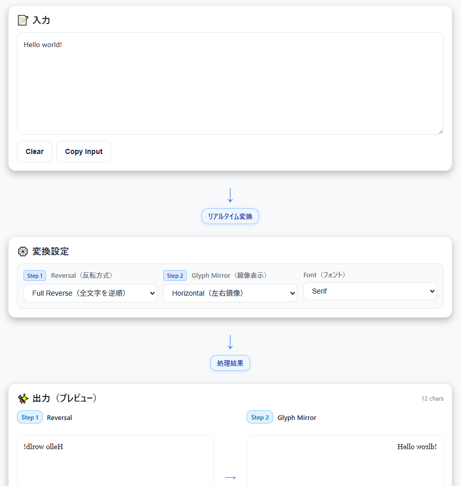

<!--
---
title: Mirror CipherLab
category: classical-cryptography
difficulty: 1
description: Learn and visualize “mirror ciphers” (text reversal & mirrored rendering) with instant, client-side demos.
tags: [mirror, cipher, reversal, visualization, education, javascript]
demo: https://ipusiron.github.io/mirror-cipherlab/
---
-->

# Mirror CipherLab – ミラー系暗号化・難読化ツール


[](https://ipusiron.github.io/mirror-cipherlab/)

**Mirror CipherLab** はミラー系のシンプルな暗号・難読化を学ぶための可視化ツールです。

**文字順の反転**（Left↔Right）と、**字形の鏡像レンダリング**（CSS変形）を同時に体験できます。

---

## 🌐 デモページ

👉 **[https://ipusiron.github.io/mirror-cipherlab/](https://ipusiron.github.io/mirror-cipherlab/)**

ブラウザーで直接お試しいただけます。

---

## 📸 スクリーンショット

>
>*"Hello world!"の逆転値暗号文と鏡文字の比較*

---

## ✨ できること（機能一覧）

- **反転モード（Reversal Types）**
  - **Full Reverse**：全文字の並びを逆順に
  - **Word-wise Reverse**：単語ごとに文字反転（単語順は保持）
  - **None**：反転なし（プレビュー専用）
- **鏡像レンダリング（Glyph Mirror）**
  - **Horizontal Mirror**：CSSの `scaleX(-1)` で左右反転表示
  - **Vertical Mirror**：CSSの `scaleY(-1)` で上下反転表示（おまけ）
- **リアルタイム可視化**
  - 入力から出力まで縦に配置し、処理フローを視覚的に表示
  - Step 1（Reversal）→ Step 2（Glyph Mirror）の2段階処理を並べて比較
- **ユースケース補助**
  - **コピー**（入力・出力）、**クリア**、**ダウンロード（.txt）**
  - **共有用URL生成**（入力と設定をハッシュ化して埋め込み）
- **UI/UX機能**
  - **ダーク/ライトモード切り替え**（テーマボタン）
  - **フォント切り替え**（System UI / Serif / Monospace）
  - **レスポンシブデザイン**（モバイル・タブレット対応）
- **アクセシビリティ**
  - フォーカス表示、ARIA属性、キーボード操作対応
  - 色依存しない強調、RTL（右→左）表示の挙動メモ付き

---

## 🎓 教育的ポイント

- **ミラー暗号は「暗号」というより簡単な難読化**：アルゴリズムが簡素で、総当たりで即復元可能。  
- **人間認知の錯覚体験**：鏡像や逆順表示で「読みにくさ」を疑似体験し、**実セキュリティ強度は低い**ことを理解。  
- **UI/UX観点**：RTL言語・文字結合・絵文字・結合文字（ZWNJ等）での表示崩れや、**文字処理の境界条件**に触れられる。

---

## 👥 想定ターゲット層

- **情報セキュリティ入門者**：古典暗号の基礎を学びたい方
- **プログラミング学習者**：文字列処理やUnicode操作の実例を見たい方
- **教育関係者**：暗号学や情報セキュリティの講義で使える教材を探している講師
- **開発初学者**：JavaScriptによるDOM操作やCSS変形の実装例を学びたい方
- **一般ユーザー**：鏡文字や文字反転の仕組みに興味がある方
- **UI/UX研究者**：テキスト処理の視覚化やアクセシビリティに関心がある方

---

## 💡 活用シナリオ

### シナリオ1：情報セキュリティ教育での導入教材

**対象**：高校・大学の情報セキュリティ授業、社内セキュリティ研修

**活用方法**：
1. **古典暗号の入門**として、もっともシンプルな転置式暗号（逆転値暗号）を体験
2. 「暗号らしく見えるが実際は無防備」という事例を通じて、**暗号強度の概念**を理解
3. Full ReverseとWord-wise Reverseの違いを比較し、**アルゴリズムの多様性**を学習
4. Word-wise Reverseで得られた鏡文字を、リアルの鏡を使って読めるかを試す
5. Share URL機能で課題を配布し、学生が自宅で復習できる環境を提供

**学習目標**：
- 暗号と難読化の違いを理解する
- セキュリティ強度の概念を体感する
- 転置式暗号の基本原理を学ぶ

---

### シナリオ2：文字列処理・Unicode学習の実践教材

**対象**：プログラミングスクール、独学プログラマー

**活用方法**：
1. **絵文字・サロゲートペア**を含むテキストで試し、Unicodeの複雑さを体験
2. Word-wise Reverseのロジックを読み解き、**正規表現による文字列分割**を学習
3. RTL言語（アラビア語・ヘブライ語）や結合文字を入力し、**ブラウザー依存の挙動**を観察
4. ソースコード（script.js）を読んで、`[...str].reverse()` による**コードポイント単位処理**を理解

**学習目標**：
- JavaScriptでのUnicode安全な文字列操作を習得
- ブラウザーのテキストレンダリング挙動を理解
- 正規表現とsplit/joinパターンを学ぶ

---

### シナリオ3：認知科学・視覚心理学の実験ツール

**対象**：認知科学研究者、心理学授業

**活用方法**：
1. **鏡像文字の読解実験**：被験者にHorizontal Mirrorテキストを提示し、読解時間を計測
2. **逆順テキストの認知負荷測定**：「Full Reverse vs Word-wise Reverse」の読みやすさ比較
3. **慣れの効果検証**：同じテキストを繰り返し読ませ、処理速度の向上を記録
4. フォント切り替え機能で、**書体が鏡文字認識に与える影響**を調査

**学習目標**：
- 人間の文字認識メカニズムを実験的に理解
- 鏡像処理と脳の視空間認知の関係を探る
- 学習効果と神経可塑性の基礎を体感

---

## 🚀 使い方（超簡単）

1. **入力欄**にテキストを貼り付け
2. **変換設定**で処理方法を選択
   - **Reversal（反転方式）**: Full Reverse / Word-wise Reverse / None
   - **Glyph Mirror（鏡像表示）**: None / Horizontal / Vertical
   - **Font（フォント）**: System UI / Serif / Monospace
3. **出力（プレビュー）**で結果を確認
   - Step 1: Reversal処理後のテキスト
   - Step 2: Glyph Mirror適用後の最終結果
4. 必要なら **Copy Output / Download / Share URL** を利用
5. 右上のテーマボタン（☀️/🌙）でダーク/ライトモード切り替え

---

## ⚠️ 制限事項・注意

- これは**教育用デモ**です。実用暗号としての安全性はありません。
- 絵文字・結合文字・RTL混在テキストはレンダリング差異が出ることがあります（ブラウザー依存）。
- 入力データはネット送信されません（完全にクライアント側で処理）。
- Share URL機能はURLハッシュに設定を埋め込みます（テキストは最大50,000文字）。
- セキュリティ対策：CSP、入力バリデーション、XSS対策を実装済み。

---

## 🔐 ミラー暗号は転置式暗号の一種

ミラー暗号（Mirror Cipher）は、平文を逆順に並べる暗号化方式です。
もっともシンプルな転置式暗号の1つに位置づけられます。
この種の転置を **逆順転置** あるいは単に **逆転値** というため、**逆転値暗号** とも呼ばれます。

---

### 鏡文字と鏡文字暗号

**鏡文字（mirror writing）** は、鏡に映したように左右を反転させた文字のことです。

英語の場合、しばしば文字だけでなく書き方向も逆（右から左へ）になります。
その際、文字の傾斜は普通の左下がりにすると、鏡に映したときに異質なアルファベットが並んだように見えてしまいます。

ことでもとのメッセージに戻せる文字列のことです。
文字の位置としては、鏡文字暗号のように逆順に並んでいますが、文字そのものが左右反転しているという大きな違いがあります。

---

### 鏡文字暗号のバリエーション

- 単語の順序が逆順
  - 後ろから読むと意味が通じる。
  - 単語ベースの回文の変種といえる。
  - 以下の例1
- 単語ごとに綴りを逆転置
  - 以下の例2
- 文単位で逆転置
- ブロック（一定文字数）に区切り、そのブロック内で逆転置
  - たとえば、1ブロックが5文字組であれば、第1文字と第5文字、第2文字と第4文字を入れ替える。
- 転置の二重化
  - ブロック内で何らかの転置（上記のように逆転値でもよい）し、その後でブロック単位を逆転値

例1：ルイス・キャロルが友人に当てた手記

> Uncle loving
> your! instead grand-
> son his to it give to
> had you that so, yeas
> 80 or 70 for it forgot
> you that was it pity
> a what and: him of fond
> so were you wonder don't
> I and, gentleman old
> nice very a was he. For
> it made you that HIM
> been have MUST it see
> you so: grandfather my
> was, then alive was that,
> "Dodgson Uncle" only
> the, born was I befor

これは単語単位で逆転置になっています。
元に戻すと以下のメッセージが得られます（文頭の大文字化は調整した）。

> Before I was born, the only "Uncle Dodgson", that was alive then, was my grandfather: so you see ti MUST have been HIM that you made it for.
> He was a very nice old gentleman, and I don't wonder you were so fond of him: and what a pity it was that you forgot it for 70 or 80 yeas, so that you had to give it to his grand-son instead!
> Your loving uncle

例：ジョナサン・スウィフト（『ガリバー旅行記』の著者として有名）がリチャード・シェリダンに宛てたラテン語もどきの次の文章です。

> Mi sana. Odioso ni mus rem. Moto ima os illud dama nam?

↓ 単語ごとに綴りを逆順。文頭の頭文字を調整。

> Im anas. Osoido in sum mer. Otom ami so dulli amad man?

↓ 意味が通じるように、空白・句読点・欠落文字を調整。

> I'm an ass. O so I do in summer. O Tom, am I so dull, I a mad man?

---

## 📜 鏡文字の歴史的背景

**鏡文字（Mirror Writing）**は、暗号というよりも文化史的・心理学的な現象として注目されてきました。

- **古代・中世の例**  
  - エトルリア文字や古代ギリシャ文字には、右から左に書かれた例や、文字を反転させた「ブストロフェドン書法（牛耕式）」が存在。  
  - 中世以降も碑文や装飾文字として左右反転が用いられた例が報告されている。

- **近代以降の著名な例**  
  - **レオナルド・ダ・ヴィンチ**のノートには鏡文字で書かれた記録が多数残っており、「秘密保持」や「左利きで書きやすいから」など諸説がある。 
  - 近代医学においては「鏡文字を書く習癖」が脳損傷や失語症の診断材料として研究された（例：Critchley, *The Phenomenon of Mirror Writing*, Brain, 1928）。

- **日本における例**  
  - 鏡文字は魔除けやシンボル的表現に利用された例があり、寺社の碑文や護符に逆書きの文字が見られることがあります。
  - 和歌の「5・7・5・7・7」において、それぞれの句の中で逆転置する例がある。

---

## 🔍 暗号的価値の評価

ミラー暗号は「文字の順序を反転させるだけ」なので、**暗号としての強度は皆無に等しい**と評価されます。  

- **解読の容易さ**  
  - 人間が直感的に逆さ読みすれば容易に読めてしまう。  
  - コンピューターであればワンライナー（`[::-1]` のような操作）で即復元可能。  

- **古典暗号学的観点**  
  - フリードマンやカーンらの暗号史研究においても、鏡文字は「暗号」ではなく「難読化（obfuscation）」の範疇に位置づけられる。  
  - 暗号理論的には「情報量の低下」を一切もたらさず、秘密保持には寄与しない。

つまり、暗号としての価値は**教育的・遊戯的な意義に限定される**と言えるでしょう。

---

## 🧪 他分野での具体的応用例

- 認知科学：人間の文字認識・脳機能・学習の研究材料として活用されてきた。  
- ソーシャルエンジニアリング：混乱や誤認を誘発し、人間の注意力の限界を突く教材に応用可能。  
- ステガノグラフィー：単純な隠蔽やユニコード制御文字の研究に直結し、実セキュリティ脅威とも関わる。  

鏡文字は「暗号」としては価値が低いものの、**人間認知と情報セキュリティの交差点**を考える上で、多方面に応用可能な教材となるのです。

---

### 認知科学・心理学
- **読解処理の研究**  
  鏡文字を読むとき、通常の文字認識とは異なる脳領域が関与するとされる。実験心理学の研究では、鏡文字の読解は右半球の視覚処理や空間認知機能が強く関与することが示唆されており、失語症や脳損傷の診断補助として利用されることがある。
  - 例：Critchley, 1928; Franklin, 1989
- **学習実験**  
  文字反転を課題とすることで、人間の「認知負荷」や「慣れの効果」を定量化できる。被験者は最初は時間がかかるが、数回の練習で処理速度が向上することが知られている。これは「スキル習得と神経可塑性」の研究材料になる。
- **視覚錯誤と記憶**  
  鏡像化されたテキストは一瞬読みにくいため、短期記憶により強く残る場合がある。この性質を教育・広告の実験に利用する研究も存在する。

---

### ソーシャルエンジニアリング
- **人間の混乱を利用した情報獲得**  
  鏡文字や反転テキストは、文書の一部を「わかりにくく」することで相手の注意を逸らしたり、偽装したりする手段として用いられる可能性がある。  
  例：  
  - 改ざんされた契約書で、署名欄や重要語が鏡文字で挿入され、見落としを誘発する。  
  - 偽の提示資料に鏡像化した情報を混ぜて「秘密めいた信憑性」を演出し、相手に誤解を与える。  
- **フィッシング訓練教材**  
  社員教育において、鏡文字の入ったメールを敢えて提示し「読めるけれど正規メールではあり得ない」という異常検知の感覚を育てることができる。  
- **物理的セキュリティとの組み合わせ**  
  ショルダーハック（Shoulder Surfing）対策のデモで、鏡像表示を使うと「第三者には読みにくいが本人は読める」状況を再現可能。これは「ユーザー認知とセキュリティ」の境界を理解させる教材になる。

---

### ステガノグラフィー（情報隠蔽）
- **鏡像テキストによる隠蔽**  
  鏡文字そのものは暗号的安全性はないが、「ぱっと見には読めない」ため、短期的な情報隠しとして利用されることがある。
  例：  
  - 画像の片隅に鏡像化した単語を埋め込み、第三者が気づきにくい形で伝達。  
  - 出版物やポスターに「左右反転文字」を仕込んでメッセージを隠す（ステガノグラフィーの一形態）。  

- **電子データへの応用**  
  - HTML/CSSで鏡像を実現する場合、DOMには平文が残る一方で表示上は反転されるため、人間には読みづらい「ステガノグラフィー的効果」をもたらす。  
  - Unicodeには「双方向制御文字」や「左右反転に類似した不可視制御記号」が存在し、これを悪用すると表示上は異なる内容に見せかけることが可能。
  - この性質はセキュリティ的に「混乱攻撃（confusables / homograph attack）」として重要な脆弱性研究テーマになっている。

---

### OCR・自動収集防止
- **効果**  
  簡易OCRや正規表現検索を妨害できます。たとえば「password」を逆転させて埋め込むと単純なパターン抽出にはヒットしない。  
  住所・メールアドレスなどを鏡文字化して画像に埋め込むと、スクレイピングボットに対する障壁になる。  
- **限界**  
  近年のディープラーニングOCRは鏡文字や反転テキストを補正して認識できる。 
  読みにくさは人間にとっても大きく、ユーザビリティを損ねる可能性がある。  
  本質的なセキュリティ強化にはつながらず、あくまで「難読化」の範囲に留まる。

---

## 📁 ディレクトリー構成

```
mirror-cipherlab/
├── index.html          # メインHTMLファイル
├── script.js           # JavaScript（反転処理、UI制御、テーマ切り替え）
├── style.css           # スタイルシート（ダーク/ライトモード対応）
├── README.md           # このファイル
├── CLAUDE.md           # Claude Code用の開発ガイド
├── LICENSE             # MITライセンス
├── .nojekyll           # GitHub Pages設定
├── .gitignore          # Git除外設定
├── .claude/            # Claude Code設定ディレクトリ
│   └── settings.local.json
└── assets/             # スクリーンショットなどの画像
    └── screenshot.png
```

**主要ファイルの役割**：
- **index.html**: アプリケーションのUI構造、CSP設定、ARIA属性
- **script.js**: テキスト反転アルゴリズム、URL共有機能、テーマ管理、セキュリティバリデーション
- **style.css**: レスポンシブレイアウト、ダーク/ライトモードのカラースキーム、アニメーション

---

## 📄 ライセンス

MIT License – 詳細は [LICENSE](LICENSE) を参照してください。

---

## 🛠 このツールについて

本ツールは、「生成AIで作るセキュリティツール100」プロジェクトの一環として開発されました。
このプロジェクトでは、AIの支援を活用しながら、セキュリティに関連するさまざまなツールを100日間にわたり制作・公開していく取り組みを行っています。

プロジェクトの詳細や他のツールについては、以下のページをご覧ください。

🔗 [https://akademeia.info/?page_id=42163](https://akademeia.info/?page_id=42163)