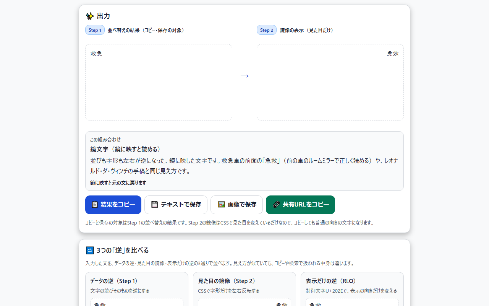
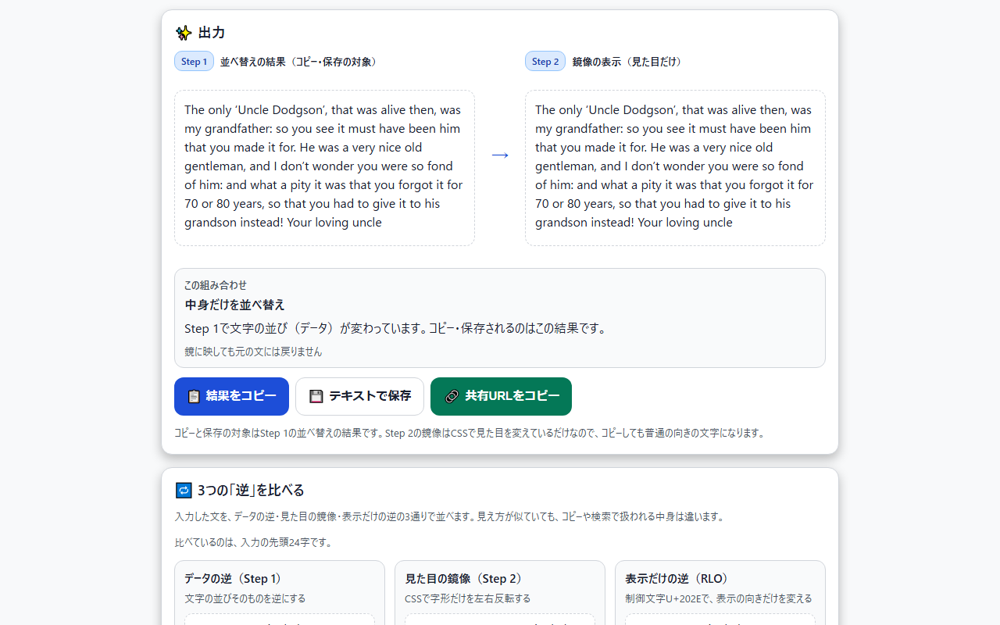
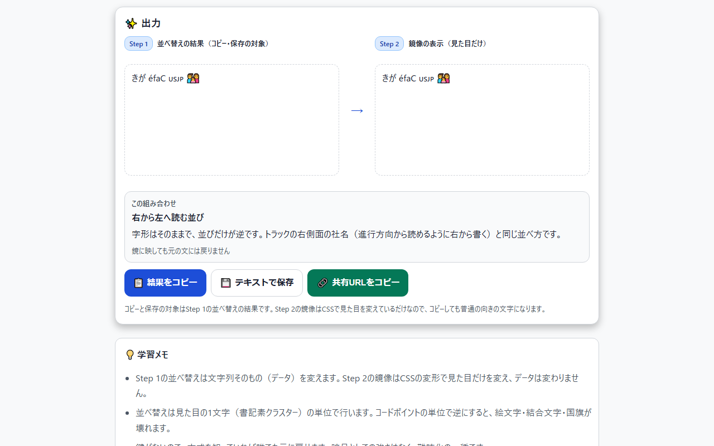
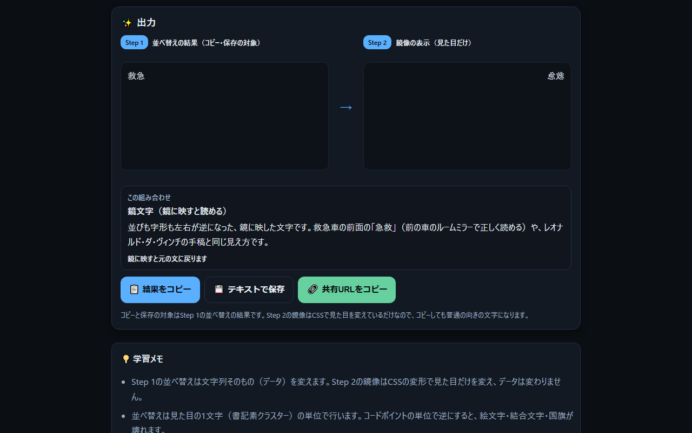
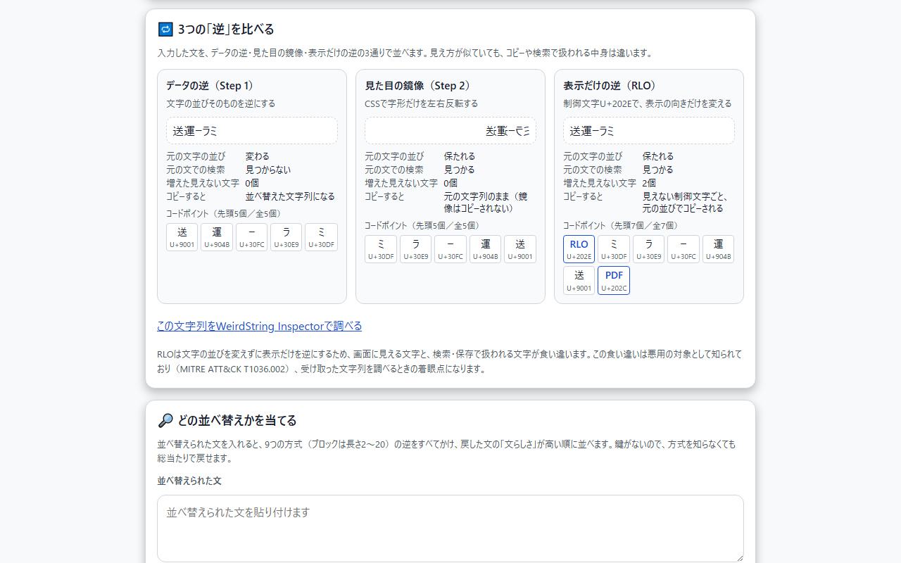
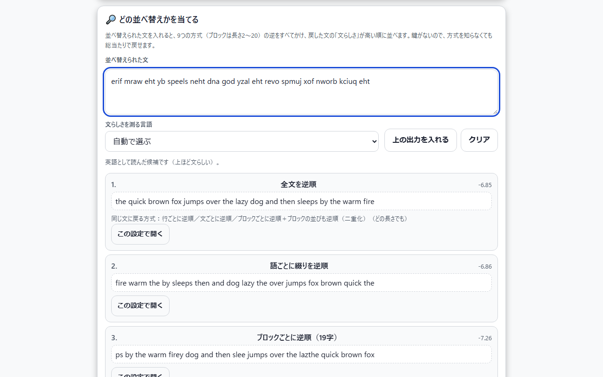
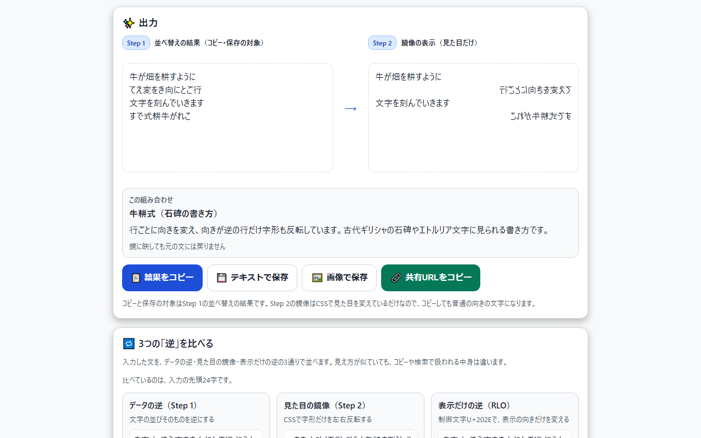

<!--
---
id: day084
slug: mirror-cipherlab

title: "Mirror CipherLab"

subtitle_ja: "ミラー系暗号化・難読化ツール"
subtitle_en: "Mirror Cipher Visualization Tool"

description_ja: "文字の並びの逆転置（全文・語・語順・行・文・ブロック）と、字形の鏡像表示（CSS変形）を組み合わせて体験できる教育用ツール。見た目の1文字の単位で並べ替え、鏡で読める組み合わせと現実の例を示します。"
description_en: "Learn mirror ciphers by combining text reversal (whole text, words, word order, lines, sentences, blocks) with mirrored glyph rendering (CSS transform). Reorders by grapheme cluster and shows which combinations can be read in a mirror."

category_ja:
  - 古典暗号
  - 転置式暗号
category_en:
  - Classical Cryptography
  - Transposition Cipher

difficulty: 1

tags:
  - mirror-cipher
  - reversal
  - transposition
  - visualization
  - obfuscation
  - unicode
  - client-side

repo_url: "https://github.com/ipusiron/mirror-cipherlab"
demo_url: "https://ipusiron.github.io/mirror-cipherlab/"

hub: true
---
-->

[English](README.en.md) · 日本語

# Mirror CipherLab - ミラー系暗号化・難読化ツール


[](https://ipusiron.github.io/mirror-cipherlab/)

**Day084 - 生成AIで作るセキュリティツール100**

Mirror CipherLabは、文字の並びを逆にする「逆転置」と、字形を鏡に映す「鏡像表示」を組み合わせて体験できる教育用ツールです。

全文・語ごと・語の並び・行・文・ブロックなど9つの並べ替えを、絵文字や結合文字も崩さない見た目の1文字（書記素クラスター）の単位で行います。選んだ組み合わせが鏡に映すと読めるのか、現実のどんな表示と同じなのかを画面に示します。

データの逆・見た目の鏡像・表示だけの逆（制御文字RLO）の違いを並べて比べられます。並べ替えられた文から、どの方式だったかを総当たりで当てる機能もあります。

---

## 🌐 デモページ

👉 **[https://ipusiron.github.io/mirror-cipherlab/](https://ipusiron.github.io/mirror-cipherlab/)**

ブラウザーで直接お試しいただけます。

---

## 📸 スクリーンショット

>
>
>*救急車の前面と同じ鏡文字（並べ替えなし＋左右の鏡像）*

>
>
>*キャロルの逆さ手紙を、語の並びの逆順で読み下す*

>
>
>*絵文字・国旗・結合文字も見た目の1文字のまま逆順に*

>
>
>*ダークモード（救急車の例）*

>
>
>*3つの「逆」を比べる（コードポイントまで並べる）*

>
>
>*どの並べ替えかを当てる（候補を文らしい順に並べる）*

>
>
>*牛耕式（行ごとに向きが変わり、逆向きの行だけ字形も反転）*

Windowsの標準のフォントは国旗の絵文字を持たないため、国旗は地域指示記号の2文字（JP・USなど）で表示されます。

---

## ✨ 機能

### Step 1：並べ替え（中身が変わる）

入力した文字列そのものを並べ替えます。コピー・保存・共有の対象はこの結果です（表の`\n`は改行）。

| 方式 | すること | 入力 | 出力 |
|---|---|---|---|
| 並べ替えない | 何もしない（Step 2の鏡像だけを試すとき） | `Hello world!` | `Hello world!` |
| 全文を逆順 | 全体を後ろから並べる | `Hello world!` | `!dlrow olleH` |
| 語ごとに綴りを逆順 | 語の綴りだけを逆にし、記号と空白は位置を保つ | `Hello, world!` | `olleH, dlrow!` |
| 語の並びを逆順 | 語と記号を単位に並びを逆にし、記号は前の語に付け、括弧は向きを入れ替える | `Hello (big) world.` | `. world (big) Hello` |
| 行ごとに逆順 | 各行を逆にする（行の並びは保つ） | `abc\ndef` | `cba\nfed` |
| 行の並びを逆順 | 行の並びだけを逆にする | `1\n2\n3` | `3\n2\n1` |
| 文ごとに逆順 | 文末の記号と空白は位置を保ち、文の中身を逆にする | `Line one. Line two!` | `eno eniL. owt eniL!` |
| ブロックごとに逆順（n=5） | n字ずつに区切り、ブロックの中を逆にする | `ATTACKATDAWN` | `CATTAADTAKNW` |
| ブロックごとに逆順＋ブロックの並びも逆順（n=5） | ブロックの中を逆にしてから、ブロックの並びも逆にする | `ATTACKATDAWN` | `NWADTAKCATTA` |
| 牛耕式 | 偶数行（2行目・4行目…）だけを逆順にする | `abc\ndef` | `abc\nfed` |

- ブロックの文字数は2〜20である（既定は5）。
- 「文頭の大文字を整える」を選ぶと、並べ替えたあとの文頭を大文字にする（「しくみ」の節）。

### Step 2：字形の鏡像（見た目だけ）

| 選択肢 | CSS | 見え方 |
|---|---|---|
| 鏡像なし | なし | そのまま |
| 左右の鏡像 | `transform: scaleX(-1)` | 横に立てた鏡に映した形 |
| 上下の鏡像 | `transform: scaleY(-1)` | 水面に映した形 |
| 180度の回転 | `transform: scale(-1, -1)` | 紙をさかさまにした形 |

牛耕式を選んだときだけ、鏡像は行ごとに掛かります（向きが逆になる行だけが反転し、石碑と同じ見え方になります）。

文字列は変わらないので、コピーしても普通の向きの文字になります。

### 組み合わせの説明

Step 1とStep 2の組み合わせごとに、見え方と現実の例、鏡に映すと元の文に戻るかを画面に出します。

| Step 1 | Step 2 | 見え方 | 鏡に映すと | 現実の例 |
|---|---|---|---|---|
| 並べ替えない | 左右の鏡像 | 鏡文字 | 元の文に戻る | 救急車の前面の「急救」、ダ・ヴィンチの手稿 |
| 並べ替えない | 上下の鏡像 | 水面に映した文字 | 文の下に置いた鏡で元の文に戻る | なし |
| 全文を逆順 | 鏡像なし | 右から左へ読む並び | 戻らない | トラックの右側面の社名 |
| 全文を逆順 | 左右の鏡像 | 並びは元どおりで、字形だけが反転 | 戻らない | 左馬を並べたような見え方 |
| 全文を逆順 | 上下の鏡像 | 逆順を上下に反転 | 戻らない | なし |
| 全文を逆順 | 180度の回転 | 並びの逆と回転が打ち消し合う | 戻らない | なし |
| 牛耕式 | 左右の鏡像 | 行ごとに向きが変わり、逆向きの行は字形も反転 | 戻らない | 古代ギリシャの石碑、エトルリア文字 |
| そのほかの方式 | 鏡像なし・あり | 中身だけを並べ替え（とその鏡像） | 戻らない | なし |

### 3つの「逆」を比べる

入力した文を、次の3通りで並べて見せます。見え方が似ていても、コピーや検索で扱われる中身は違います。

| 種類 | 文字の並び | 元の文での検索 | コピーされるもの |
|---|---|---|---|
| データの逆（Step 1） | 変わる | 見つからない | 並べ替えた文字列 |
| 見た目の鏡像（Step 2） | 変わらない | 見つかる | 元の文字列（鏡像はコピーされない） |
| 表示だけの逆（RLO） | 変わらない（制御文字が増える） | 見つかる | 見えない制御文字ごと、元の並び |

それぞれのコードポイントを1つずつ並べ、見えない文字は略号（RLO・PDFなど）で見せます。
表示だけを逆にする制御文字RLO（U+202E）は、画面に見える文字と、検索・保存で扱われる文字を食い違わせます。
この食い違いは悪用の対象として知られており（MITRE ATT&CK T1036.002）、受け取った文字列を調べるときの着眼点になります。
WeirdString Inspector（Day023）へ渡すリンクも置いています。

### どの並べ替えかを当てる

並べ替えられた文を入れると、9つの方式（ブロックは長さ2〜20）の逆をすべてかけ、戻した文の「文らしさ」が高い順に5件まで並べます。
鍵がないので、方式を知らなくても総当たりで戻せます。
文らしさは、文字の連なりの出やすさで測ります（英語は4文字の連なりと「よく出る語として読めるか」、日本語は3文字の連なり）。
統計は、パブリックドメインの文章から作った`js/lang-model.js`に入っています（「解読の精度」の節）。

### そのほか

- 例文7つ（スウィフト・キャロル・救急車・トラック・絵文字・牛耕式・二重化。選ぶと文と設定がそろう）
- 3通りの文字数の表示（見た目の文字数・コードポイント数・UTF-16の長さ）
- 結果のコピー、テキストファイルでの保存、画像（PNG）での保存
- 共有URL（文と設定をURLの`#`の後ろに入れる。長さを表示し、2,000字を超えたら警告する）
- ダークモードとライトモード（OSの設定に従い、ボタンで切り替える）
- 日本語と英語の画面（`?lang=ja`・`?lang=en`でも指定できる。選択はブラウザーに保存する）
- フォントの切り替え（システムUI・セリフ体・等幅）

---

## 📖 使い方

1. 入力欄に文を入れる（「例文を入れる」から選んでもよい）。
2. 「変換の設定」のStep 1で並べ替えの方式を、Step 2で鏡像を選ぶ。
3. 「出力」で、並べ替えの結果（Step 1）、鏡像の表示（Step 2）、組み合わせの説明を見る。
4. 「結果をコピー」「テキストで保存」で結果を取り出す。「共有URLをコピー」で、同じ文と設定をほかの人に渡せる。

元に戻すときは、並べ替えた文を入力欄に入れ、同じ方式・同じ設定を選びます。どの方式も2回かけると元の文に戻ります（日本語の「語ごと」を除く。「しくみ」の節）。

---

## 🔐 ミラー暗号は転置式暗号の一種

ミラー暗号（Mirror Cipher）は、平文を逆順に並べる暗号化方式です。
文字そのものは変えずに位置だけを入れ替えるので、最も単純な転置式暗号の1つに位置づけられます。
この種の転置を逆順転置、あるいは単に**逆転置**というため、逆転置暗号とも呼ばれます。

---

### 鏡文字と鏡文字暗号

鏡文字（mirror writing）は、鏡に映したように左右を反転させた文字のことです。

英語の場合、しばしば文字だけでなく書き方向も逆（右から左へ）になります。
その際、文字の傾斜は普通の左下がりにすると、鏡に映したときに異質なアルファベットが並んだように見えてしまいます。

鏡文字暗号は、鏡に映す（あるいは逆から読む）ことで元のメッセージに戻せる文字列のことです。
文字の位置としては逆転置暗号のように逆順に並んでいますが、文字そのものが左右反転しているという大きな違いがあります。
本ツールでは、Step 1の「並べ替えない」とStep 2の「左右の鏡像」の組み合わせが鏡文字暗号の見え方になります。

---

### 鏡文字暗号のバリエーション

- 単語の順序が逆順（本ツールの「語の並びを逆順」）
  - 後ろから読むと意味が通じる。
  - 単語ベースの回文の変種といえる。
  - 以下の例1
- 単語ごとに綴りを逆転置（「語ごとに綴りを逆順」）
  - 以下の例2
- 文単位で逆転置（「文ごとに逆順」）
- ブロック（一定文字数）に区切り、そのブロック内で逆転置（「ブロックごとに逆順」）
  - たとえば、1ブロックが5文字組であれば、第1文字と第5文字、第2文字と第4文字を入れ替える。
- 転置の二重化（「ブロックごとに逆順＋ブロックの並びも逆順」）
  - ブロック内で何らかの転置（上記のように逆転置でもよい）をし、その後でブロック単位を逆転置する。
  - 両方とも逆転置にすると、全文の逆転置とまったく同じ結果になる（「しくみ」の節）。

例1：ルイス・キャロルがネリー・ボウマンに宛てた手紙（1891年11月1日）の一部です（翻刻はFutility Closetによる）。

> Uncle loving your! Instead grandson his to it give to had you that so, years 80 or 70 for it forgot
> you that was it pity a what and: him of fond so were you wonder don’t I and, gentleman old nice very a
> was he. For it made you that him been have must it see you so: grandfather my was, then alive was that,
> ‘Dodgson Uncle’ only the

これは単語の単位で逆転置になっています。
本ツールで「語の並びを逆順」と「文頭の大文字を整える」を選ぶと、次の文が得られます。

> The only ‘Uncle Dodgson’, that was alive then, was my grandfather: so you see it must have been him
> that you made it for. He was a very nice old gentleman, and I don’t wonder you were so fond of him:
> and what a pity it was that you forgot it for 70 or 80 years, so that you had to give it to his
> grandson instead! Your loving uncle

元の文の「grandfather: so」が手紙では「so: grandfather」になっているように、キャロルはコロンやカンマも1つの単位として逆に並べ、前の語に付けて書いています。

例2：ジョナサン・スウィフトの作として伝わる、ラテン語もどきの次の文章です。

> Mi sana. Odioso ni mus rem. Moto ima os illud dama nam?

↓ 単語ごとに綴りを逆順。文頭の頭文字を調整（本ツールの「語ごとに綴りを逆順」と「文頭の大文字を整える」）。

> Im anas. Osoido in sum mer. Otom ami so dulli amad man?

↓ 意味が通じるように、空白・句読点・欠落文字を調整。

> I'm an ass. O so I do in summer. O Tom, am I so dull, I a mad man?

この文はリチャード・ブリンズリー・シェリダンに宛てたものとして紹介されることがありますが、R.B.シェリダンはスウィフトの没後（1751年）の生まれです。
スウィフトの友人はその祖父のトマス・シェリダン（1687〜1738年）で、文中の「O Tom」とも合います。
ただし、この文の原典となる書簡は確認できていません。

---

## 🔬 しくみ

### 見た目の1文字（書記素クラスター）で並べ替える

画面で1文字に見える文字が、複数のコードポイントでできていることがあります。
コードポイントの単位で逆にすると、1文字を構成する要素の順序が入れ替わって別の文字になります。

| 入力 | コードポイントの単位で逆にした結果 | 本ツール |
|---|---|---|
| 家族の絵文字（U+1F468・ZWJ・U+1F469・ZWJ・U+1F467） | 子・母・父の順の別の並びになり、フォントによっては3つに分かれる | 1文字のまま動く |
| 「か」と結合濁点（U+3099）で書いた「がき」 | 濁点が「き」に付いて「ぎか」になる | 「きが」 |
| 日本とアメリカの国旗（地域指示記号J・P・U・S） | S・U・P・Jの組になり、別の旗と読めない組になる | アメリカ・日本の順 |
| 「e」と結合アキュート（U+0301）で書いた「Café!」 | アクセントが「!」に付く | 「!éfaC」 |

JavaScriptの`[...str].reverse()`や、CyberChefのReverse（Character）はサロゲートペアを守るだけなので、上の例はどれも崩れます。
本ツールは`Intl.Segmenter`（`granularity: "grapheme"`）で区切ってから並べ替えます。
画面には見た目の文字数・コードポイント数・UTF-16の長さを並べて出し、家族の絵文字1つは見た目1字・コードポイント5・UTF-16の長さ8と表示されます。

### 語の区切り

「語ごとに綴りを逆順」と「語の並びを逆順」は、`Intl.Segmenter`（`granularity: "word"`）で語を区切ります。
日本語は空白で区切らないので、ブラウザーの辞書で語を区切ります（例：「世界で一番。」→「世界／で／一番／。」）。

「語の並びを逆順」では、カンマ・コロン・感嘆符・引用符も1つの単位として並べ替え、前の語に付けて書きます。
括弧と引用符（‘ ’ “ ” 「 」など）は向きを入れ替えます。
記号の規則が決めない箇所では、元の文の同じ2つの間に空白があったかどうかをそのまま写します（日本語の語の間には空白を入れません）。

### 文ごと・ブロック・二重化

- 文ごと：文末の記号（. ! ? … 。 ！ ？）と、その前後の空白・改行を位置に残し、間の中身を逆にする。
- ブロック：改行も1字と数える。最後のブロックは短くてよく、それも逆にする。
- 二重化：全体の逆順は、ブロックの並びの逆順と各ブロックの中の逆順を重ねたものと同じなので、どのブロックの長さでも結果は全文の逆順と一致する（テストで2〜20を確かめている）。

### 牛耕式

偶数行（2行目・4行目…）だけを逆順にします。
牛が畑を耕すときのように、行の終わりで向きを変える書き方です（名前は古代ギリシャ語の「牛」と「turn」に由来します）。
古代ギリシャの石碑やエトルリア文字に見られ、**向きが逆の行は文字そのものも鏡像で刻まれました**。
本ツールでは、並びはStep 1が、字形の反転はStep 2が受け持ちます。
Step 2で「左右の鏡像」を選ぶと、向きが逆の行だけが反転し、石碑と同じ見え方になります。

### 2回かけると元に戻る

どの方式も、同じ設定でもう一度かけると元の文に戻ります。
ただし日本語の「語ごとに綴りを逆順」は、逆にした漢字の並びを辞書が別の語に区切ることがあるため、戻らない場合があります。
たとえば「世界で一番。」は「界世で番一。」になり、これにもう一度かけても「界世で番一。」のままです（「界世」「番一」が1字ずつに区切られるため）。

### 文頭の大文字を整える

文頭だったために大文字になっていた語を小文字にしてから並べ替え、並べ替えたあとの各文の最初の語を大文字にします。
「I」のような1字の語と、「NASA」のように2字目以降にも大文字がある語は変えません。
文の区切りは文末の記号（. ! ? …）で判定します。
固有名詞は区別しないので、文頭の固有名詞は小文字になります（例1の結びの「Uncle」が「uncle」になるのはこのためです）。

### 画像での保存

Step 2の鏡像はCSSの変形なので、画面をそのまま画像にしても鏡像は入りません。
「画像で保存」では、canvasに文字を描き直してから同じ変形を掛けます。
牛耕式のときは、行ごとに変形を変えます（向きが逆の行だけを反転します）。
長い文は60行まで・1行200字までで切り、切ったことを画面に出します。
画像の背景と文字の色は、そのときのテーマ（ライト・ダーク）に合わせます。

### 解読の精度

どの並べ替えかを当てる機能の当たり具合を、統計の学習に使っていない文章で測りました。
各作品の前から70%を統計の学習に、残りの30%を評価に使い、評価用の文章から取った断片を各方式で並べ替えてから解読にかけています。
正解は「元の文が候補に出ること」としました（同じ文に戻る方式どうしは、その文では区別できないためです）。

| 文の長さ | 英語・1位 | 英語・3位以内 | 日本語・1位 | 日本語・3位以内 |
|---|---|---|---|---|
| 20字 | 54.3% | 73.8% | 40.7% | 56.9% |
| 40字 | 62.4% | 89.0% | 47.6% | 68.3% |
| 80字 | 84.0% | 96.4% | 59.5% | 75.7% |
| 160字 | 86.4% | 94.8% | 70.0% | 72.9% |

160字での、方式ごとの当たり具合（1位が正解だった割合）は次のとおりです。

| 方式 | 英語 | 日本語 |
|---|---|---|
| 全文を逆順 | 88.3% | 95.0% |
| 語ごとに綴りを逆順 | 98.3% | 0%（戻せない） |
| 語の並びを逆順 | 63.3% | 10.0% |
| 行ごとに逆順 | 88.3% | 95.0% |
| 文ごとに逆順 | 78.3% | 95.0% |
| ブロックごとに逆順 | 100% | 100% |
| ブロックごとに逆順＋ブロックの並びも逆順 | 88.3% | 95.0% |

当たりにくいのは次の2つです。

- 日本語の「語ごとに綴りを逆順」は、もう一度かけても元に戻らないため、候補に出ない（「2回かけると元に戻る」の節）
- 「語の並びを逆順」は、戻した文も語の並びを逆にした文も、どちらも語としては読めるので見分けにくい（とくに日本語）

短い文ほど当たりにくく、12字に満たないときは画面に注意を出します。

---

## 📜 鏡文字の歴史的背景

鏡文字（Mirror Writing）は、暗号というよりも文化史的・心理学的な現象として注目されてきました。

- 古代の例
  - エトルリア文字は右から左へ書かれることが多かった。古代ギリシャの石碑などには、行ごとに書く向きを変える牛耕式（ブストロフェドン）があり、逆向きの行では文字の形も左右反転して書かれた（本ツールの「牛耕式」と「左右の鏡像」の組み合わせで再現できる）。
- 近代以降の著名な例
  - レオナルド・ダ・ヴィンチのノートには鏡文字で書かれた記録が多数残っており、「秘密保持」や「左利きで書きやすいから」など諸説がある。
  - 神経学者のマクドナルド・クリッチリーは、鏡文字を書く現象を単行本『Mirror-Writing』（1928年）にまとめた。
  - ルイス・キャロルは、鏡に映して読む手紙や、語の並びを逆にした手紙を書いた（例1）。『鏡の国のアリス』（1871年）では、アリスが鏡文字の本を見つけ、鏡に映せば言葉が正しい向きに戻ると気づいて詩「ジャバウォック」を読む。
- 日本の例
  - 「馬」の字を左右反転して書いた左馬（ひだりうま）は、山形県天童市の将棋の駒の縁起物として知られ、新築や開店の祝いに贈られる。
  - 救急車の前面に「急救」と鏡文字で書く自治体がある（名古屋市・一宮市・岩倉市・横浜市など）。前の車がルームミラーで見たときに正しく読めるようにするためである。
  - トラックの右側面の社名は、進行方向から読めるように右から左へ書かれることがある。字形はそのままで並びだけが逆なので、鏡文字ではない。

---

## 🔍 暗号的価値の評価

ミラー暗号は、文字の並びを決まった規則で入れ替えるだけで、鍵がありません。
方式を知っていれば誰でも元に戻せるので、ケルクホフスの原理（方式が知られても、鍵が秘密なら安全であるべき）の意味での安全性はありません。

- 解読の容易さ
  - 人間が直感的に逆さ読みすれば容易に読めてしまう。
  - コンピューターであればワンライナー（`[::-1]`のような操作）で即復元可能。ただし`[::-1]`はコードポイントの単位なので、絵文字や結合文字は崩れる（「しくみ」の節）。
  - 本ツールの方式は9つで、ブロックの長さを含めても試す組み合わせはごくわずかである。
- 二重にしても強くならない
  - ブロック内の逆転置とブロックの並びの逆転置を重ねると、全文の逆転置と同じになる。
  - 鍵を持つ転置を重ねる二重転置とは別物である（Permutation CipherLabで試せる）。

つまり、暗号としての価値は**教育的・遊戯的な意義に限定される**と言えるでしょう。

---

## 🎯 ユースケース

### このツールならではの使い方

- 対合（2回かけると元に戻る）を確かめる（情報・暗号の授業）：全文を逆順にする変換は対合なので、同じ操作を2回かけると元に戻る。`Hello, World!`を2回逆順にすると`Hello, World!`に戻る。回文は1回でも変わらず、`たけやぶやけた`は逆順にしても`たけやぶやけた`のままである。鍵のない方式は誰でも戻せることを、計算で確かめられる。
- 「1文字」が書記素とコードポイントで食い違うことを確かめる（文字コードの授業）：`a👨‍👩‍👧b`は、見た目の文字数（書記素）が3、コードポイント数が7、UTF-16の長さが10である。書記素で逆順にすると`b👨‍👩‍👧a`になり、家族の絵文字（ZWJでつながった並び）が壊れない。コードポイント単位で逆にすると並びが崩れるため、どの単位で「1文字」を数えるかで結果が変わることを確かめられる。
- 牛耕式が偶数行だけ逆順になることを確かめる（組版・history of writingの授業）：`abc`／`def`／`ghi`の3行を牛耕式にすると、1行目はそのまま、2行目だけ逆順になって`abc`／`fed`／`ghi`になる。逆順になる行の番号は（0始まりで）1、つまり偶数番目の行だけである。行ごとに向きを交互にする古代の書き方を、計算で確かめられる。

### 学ぶ・教える

- 情報やセキュリティの授業：鍵のない方式は誰でも戻せることを、同じ操作を2回かけて元に戻すことで確かめる。暗号と難読化の違いを話す導入になる。
- プログラミングの学習：見た目の文字数・コードポイント数・UTF-16の長さが食い違う文字を入れ、文字列を逆にする処理でなぜ絵文字が壊れるのかを調べる。`Intl.Segmenter`の使い方の実例にもなる。
- 国語・英語の授業や言葉遊び：回文（「たけやぶやけた」など）を全文の逆順にかけて同じ文に戻ることを確かめたり、スウィフトの例のような逆さ言葉の作文に使ったりする。
- 歴史・文学の調べもの：キャロルの逆さ手紙のような史料を、手順を確かめながら読み下す。例文で同じ操作を再現できる。

### 仕事

- ソフトウェアのテスト：入力欄の文字数制限やカーソルの動きを試すデータとして、見た目の文字数とUTF-16の長さが違う文字列を作る。数え方はブラウザーの`Intl.Segmenter`によるもので、OSやほかのプログラミング言語の数え方と一致するとは限らない。
- 表示物の下書き：救急車の前面のように、鏡に映して読ませる表示の見え方を左右の鏡像で確かめる。画面での確認用なので、印刷や車両の表示に使うデータは別に作る。
- 心理学の実験の素材づくり：鏡文字や逆順の文を、読みの実験の刺激として用意する。表示はCSSの変形で、フォントや環境によって見え方が変わるので、提示には同じ環境を使う。上下を逆さにした活字（倒立文字）を一度読んでおくと、1年後に同じ文を速く読めたという報告（Kolers 1976）など、変形した文の読みには研究の蓄積がある。

### 暮らし・趣味

- 謎解き・脱出ゲームの問題づくり：語の並びの逆順やブロックの逆順を使った問題を作り、同じ設定でもう一度かけて答えを確かめる。
- 手紙やカードの遊び：鏡に映すと読めるメッセージを画像で保存し、印刷して鏡で読んでもらう。
- 古代の書き方をなぞる：牛耕式で数行を書き、石碑のように行ごとに向きが変わる様子を画像にする。

### セキュリティ

- 表示だけを逆にする攻撃との違いを学ぶ：「3つの「逆」を比べる」で、データの逆・見た目の鏡像・表示だけの逆（RLO、U+202E）を並べる。RLOは並びを変えずに表示だけを逆にするので、見えている文字と検索・保存で扱われる文字が食い違う（MITRE ATT&CK T1036.002）。そのままWeirdString Inspectorへ渡して、制御文字の位置まで確かめられる。
- 簡易な難読化の限界を知る：「どの並べ替えかを当てる」に並べ替えた文を入れると、方式を知らなくても総当たりで戻ることを確かめられる。鍵のない難読化が検索や目視の回避に足りないことを、手を動かして示せる。

### ほかのツールとの組み合わせ

- [Permutation CipherLab](https://ipusiron.github.io/permutation-cipherlab/)（Day095）：鍵つきの転置と比べ、鍵の有無で安全性がどう変わるかを見る。
- [Classical Cipher Structure Trainer](https://ipusiron.github.io/classical-cipher-structure-trainer/)（Day097）：逆順を含む古典暗号の構造の練習と組み合わせる。
- [Scytale Cipher Visualizer](https://ipusiron.github.io/scytale-cipher-visualizer/)（Day010）：別の転置式暗号（スキュタレー）の並べ替えと比べる。
- [WeirdString Inspector](https://ipusiron.github.io/weirdstring-inspector/)（Day023）：RLOなどの見えない文字を調べ、表示だけの逆転と比べる。

---

## 🔒 セキュリティ

- 入力した文はブラウザーの中だけで処理し、外部へ送らない。
- CSP（meta）：`default-src 'none'; script-src 'self'; style-src 'self'; img-src 'self' data:; base-uri 'none'; form-action 'none'`。インラインのスクリプト・style属性・イベントハンドラーを使わない。
- 画面への出力は`textContent`だけで行う。
- 共有URLは、文と設定をURLの`#`の後ろにbase64urlのJSONで入れる。`#`の後ろはサーバーへ送られないが、URLを渡した相手やブラウザーの閲覧履歴には文が残る。
- 共有URLを読み込むときは、形式・長さ（50,000字まで）・設定の値を一覧で確かめ、合わないものは読み込まずに理由を表示する。
- ブラウザー（localStorage）に保存するのはテーマと言語の選択だけである。保存できない環境でも動く。
- 解読に使う統計（`js/lang-model.js`）はリポジトリーに同梱し、解読もブラウザーの中だけで行う。

---

## ⚠️ 注意と限界

- 教育用のデモであり、実用の暗号としての安全性はない。
- Step 2の鏡像はCSSの変形なので、コピー・保存・共有されるのはStep 1の文字列だけである。
- 日本語の語の区切りはブラウザーの辞書による。逆にした文にもう一度かけても戻らないことがあり、ブラウザーの版によって区切りが変わる可能性もある。
- 「語の並びを逆順」は、2つ以上続く空白を1つにまとめ、文頭・文末の空白を外す。
- 「文頭の大文字を整える」は固有名詞を区別しない。
- 右から左に書く文字（アラビア語・ヘブライ語）や結合文字は、ブラウザーとフォントによって表示が変わる。
- `Intl.Segmenter`のない古いブラウザーでは、コードポイントの単位で処理する（画面に注記を出す）。
- 解読の順位は統計による推定で、1位が必ず正しいとは限らない（「解読の精度」の節）。
- 解読の統計は小説から作ったため、専門用語や会話文の多い文、固有名詞ばかりの文では当たりにくい。
- 「3つの「逆」を比べる」で見せるRLOの見え方は、左から右に書く文字を前提にした並べ替えである。右から左に書く文字（アラビア語・ヘブライ語）が混じると、ブラウザーの実際の表示と食い違うことがある。

---

## 🧪 テスト

```
npm test
```

- Node.js 22以上で動く。依存パッケージはない（`node --test`）。
- GitHub Actionsで、pushとpull requestのたびに自動で実行する。
- 各方式の既知解答、見た目の1文字の単位の逆順、2回かけると戻る性質、二重化が全文の逆順と一致すること（ブロックの長さ2〜20）、共有URLの往復と検証、3つの「逆」の事実、解読の候補の並び、配色のコントラスト比、日英のREADMEの表と例を検証する。
- 画面の操作はPlaywrightで確かめた（確認用のスクリプトはリポジトリーに含めない）。

---

## 🔗 参考

- Futility Closet「[Return of Post](https://www.futilitycloset.com/2012/01/06/return-of-post/)」（2012年1月6日）：キャロルがネリー・ボウマンに宛てた手紙（1891年11月1日）の翻刻
- Philobiblon「[Is It A Book? – Games](https://www.philobiblon.com/isitabook/games/index.html)」：スウィフトの逆さラテン語の紹介
- Lewis Carroll『[Through the Looking-Glass](https://www.gutenberg.org/ebooks/12)』（Project Gutenberg）
- Macdonald Critchley『Mirror-Writing』（Kegan Paul, Trench, Trubner & Co.、1928年、Psyche Miniatures）
- Paul A. Kolers「[Reading a year later](https://doi.org/10.1037/0278-7393.2.5.554)」（Journal of Experimental Psychology: Human Learning and Memory、2巻5号、554〜565ページ、1976年）
- くるまのニュース「[『文字が逆』では!? 救急車に『急救』反転文字なぜ? 『ターャジス』トラックの逆文字とは異なる『納得の理由』とは](https://kuruma-news.jp/post/561332)」（2022年10月9日）
- MITRE ATT&CK「[T1036.002 Masquerading: Right-to-Left Override](https://attack.mitre.org/techniques/T1036/002/)」
- Unicode Standard Annex #29「[Unicode Text Segmentation](https://www.unicode.org/reports/tr29/)」
- Wikipedia「[Boustrophedon](https://en.wikipedia.org/wiki/Boustrophedon)」
- 解読の統計に使った文章（パブリックドメイン。本文は同梱していない）
  - Project Gutenberg（英語5作品）：[Pride and Prejudice](https://www.gutenberg.org/ebooks/1342)・[Alice's Adventures in Wonderland](https://www.gutenberg.org/ebooks/11)・[Frankenstein](https://www.gutenberg.org/ebooks/84)・[The Adventures of Sherlock Holmes](https://www.gutenberg.org/ebooks/1661)・[Moby Dick](https://www.gutenberg.org/ebooks/2701)
  - [青空文庫](https://www.aozora.gr.jp/)（日本語12作品）：夏目漱石「こころ」「坊っちゃん」「吾輩は猫である」、太宰治「走れメロス」「人間失格」、芥川龍之介「羅生門」「蜘蛛の糸」、宮沢賢治「銀河鉄道の夜」「風の又三郎」、森鴎外「高瀬舟」「ヰタ・セクスアリス」、樋口一葉「たけくらべ」

---

## 📁 ディレクトリー構造

```
mirror-cipherlab/
├── .github/                      # GitHubの設定
│   └── workflows/                # GitHub Actionsのワークフロー
│       └── test.yml              # pushとpull requestでnpm testを実行する
├── assets/                       # READMEの画像
│   ├── en/                       # 英語の画面のスクリーンショット
│   │   ├── screenshot.png        # 救急車の例（英語）
│   │   ├── screenshot2.png       # キャロルの手紙（英語）
│   │   ├── screenshot3.png       # 絵文字と結合文字の逆順（英語）
│   │   ├── screenshot4.png       # 救急車の例（英語・ダークモード）
│   │   ├── screenshot5.png       # 3つの「逆」を比べる欄（英語）
│   │   ├── screenshot6.png       # どの並べ替えかを当てる欄（英語）
│   │   └── screenshot7.png       # 牛耕式と画像での保存（英語）
│   ├── screenshot.png            # 救急車の例（鏡文字の組み合わせ）
│   ├── screenshot2.png           # キャロルの手紙を語の並びの逆順で読む
│   ├── screenshot3.png           # 絵文字と結合文字を見た目の1文字のまま逆順に
│   ├── screenshot4.png           # 救急車の例（ダークモード）
│   ├── screenshot5.png           # 3つの「逆」を比べる欄
│   ├── screenshot6.png           # どの並べ替えかを当てる欄
│   └── screenshot7.png           # 牛耕式と画像での保存
├── js/                           # 画面から読み込むスクリプト
│   ├── examples.js               # 例文6つ（文と設定の組）
│   ├── messages.js               # 画面の文言の辞書（日本語・英語）
│   ├── mirror-core.js            # 並べ替えと共有URLの符号化（DOMに触れない）
│   ├── solver.js                 # 解読（全方式の逆をかけ、文らしさで並べる）
│   ├── lang-model.js             # 文らしさを測る統計（生成物。build_lang_model.pyで作る）
│   ├── render-image.js           # 表示中の文をPNGに描き直す（DOMに触れない）
│   └── reversal-compare.js       # 3つの「逆」の比較とRLOの例（DOMに触れない）
├── test/                         # 自動テスト（node --test）
│   ├── contrast.test.js          # ライト・ダークの配色のコントラスト比
│   ├── examples.test.js          # 例文の既知解答
│   ├── format.test.js            # 行の長さ・改行コード・見えない文字
│   ├── html.test.js              # index.htmlのCSP・要素・ラベル
│   ├── i18n.test.js              # 日英の辞書とREADMEの対応
│   ├── load.js                   # js/*.jsをテストに読み込む補助
│   ├── messages.test.js          # 辞書のキーの過不足
│   ├── mirror-core.test.js       # 並べ替えの方式・書記素・往復
│   ├── render-image.test.js      # 画像の描き直しと行ごとの反転
│   ├── readme.test.js            # READMEの例・表・YAML・ツリー
│   ├── reversal-compare.test.js  # 3つの「逆」の比較・RLO・Day023へのリンク
│   ├── script.test.js            # 画面の処理の書き方（静的な検査）
│   ├── solver.test.js            # 解読（どの並べ替えかを当てる）
│   └── share.test.js             # 共有URLの符号化と検証
├── .gitignore                    # Gitの除外設定
├── .nojekyll                     # GitHub PagesでJekyllを使わない
├── CLAUDE.md                     # Claude Code向けの開発ガイド
├── index.html                    # 画面の構造とCSP
├── LICENSE                       # MITライセンス
├── package.json                  # npm testの定義（依存なし）
├── README.en.md                  # 英語版のREADME
├── README.md                     # 本ドキュメント
├── script.js                     # 画面の処理（入力・表示・共有URL・テーマ・言語）
└── style.css                     # ライト・ダークの配色とレイアウト
```

---

## 💻 動作環境

- Chrome・Edge・Firefox・Safariの最近の版（`Intl.Segmenter`が使えるもの）
- HTTPでの配信と、`index.html`を直接開く方法（file://）の両方に対応
- ローカルで配信する例：`python -m http.server 8000`

---

## 📄 ライセンス

MIT License – 詳細は [LICENSE](LICENSE) を参照してください。

---

## 🛠️ このツールについて

本ツールは、「生成AIで作るセキュリティツール100」プロジェクトの一環として開発されました。
このプロジェクトでは、AIの支援を活用しながら、セキュリティに関連するさまざまなツールを100日間にわたり制作・公開していく取り組みを行っています。

プロジェクトの詳細や他のツールについては、以下のページをご覧ください。

🔗 [https://akademeia.info/?page_id=42163](https://akademeia.info/?page_id=42163)
